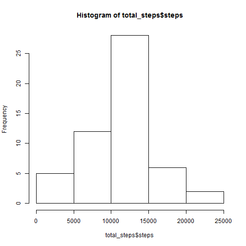
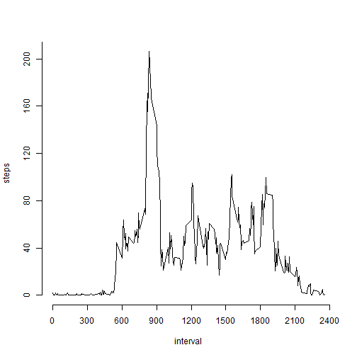
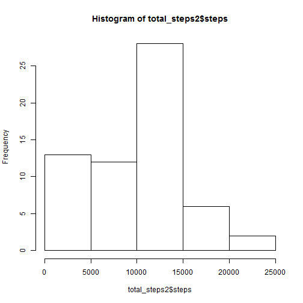
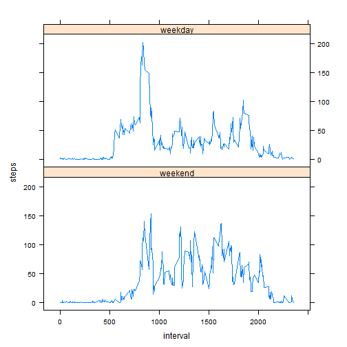

# Reproducible Research: Peer Assessment 1
#### wk dir

```r
setwd("C:\\Users\\Flavio\\Dropbox\\Coursera\\JohnsHopkins\\ReprodR\\PA1")
```
## PP :: Loading and preprocessing the data
#### download

```r
url <- "https://d396qusza40orc.cloudfront.net/repdata%2Fdata%2Factivity.zip"
ziped <- "repdata-data-activity.zip"
#download.file(url, destfile=ziped) # OK in RStudio, but not in Knitr
```
#### unzip

```r
#activity_file <- unzip(ziped,files=c("activity.csv")) # OK in RStudio, but not in Knitr
```
#### get data

The variables included in this dataset are:

* **steps**: Number of steps taking in a 5-minute interval (missing values are coded as `NA`)

* **date**: The date on which the measurement was taken in YYYY-MM-DD format

* **interval**: Identifier for the 5-minute interval in which measurement was taken

The dataset is stored in a comma-separated-value (CSV) file and there are a total of 17,568 observations in this dataset.

```r
activity_file <- "C:\\Users\\Flavio\\Dropbox\\Coursera\\JohnsHopkins\\ReprodR\\PA1\\activity.csv"
activity <- read.csv(activity_file)
str(activity)
```

```
## 'data.frame':	17568 obs. of  3 variables:
##  $ steps   : int  NA NA NA NA NA NA NA NA NA NA ...
##  $ date    : Factor w/ 61 levels "2012-10-01","2012-10-02",..: 1 1 1 1 1 1 1 1 1 1 ...
##  $ interval: int  0 5 10 15 20 25 30 35 40 45 ...
```

```r
head(activity)
```

```
##   steps       date interval
## 1    NA 2012-10-01        0
## 2    NA 2012-10-01        5
## 3    NA 2012-10-01       10
## 4    NA 2012-10-01       15
## 5    NA 2012-10-01       20
## 6    NA 2012-10-01       25
```

```r
summary(activity)
```

```
##      steps               date          interval   
##  Min.   :  0.0   2012-10-01:  288   Min.   :   0  
##  1st Qu.:  0.0   2012-10-02:  288   1st Qu.: 589  
##  Median :  0.0   2012-10-03:  288   Median :1178  
##  Mean   : 37.4   2012-10-04:  288   Mean   :1178  
##  3rd Qu.: 12.0   2012-10-05:  288   3rd Qu.:1766  
##  Max.   :806.0   2012-10-06:  288   Max.   :2355  
##  NA's   :2304    (Other)   :15840
```

#### transform

```r
activity$date <- as.Date(activity$date, format="%Y-%m-%d")
str(activity)
```

```
## 'data.frame':	17568 obs. of  3 variables:
##  $ steps   : int  NA NA NA NA NA NA NA NA NA NA ...
##  $ date    : Date, format: "2012-10-01" "2012-10-01" ...
##  $ interval: int  0 5 10 15 20 25 30 35 40 45 ...
```
## Q1 :: What is mean total number of steps taken per day?

##### instructions

*For this part of the assignment, you can ignore the missing values in the dataset.*

1. Make a histogram of the total number of steps taken each day

2. Calculate and report the mean and median total number of steps taken per day

```r
total_steps <- aggregate(steps ~ date, data = activity, sum, na.rm = TRUE)
hist(total_steps$steps)
```

 

```r
tsmean <- mean(total_steps$steps)
tsmedian <- median(total_steps$steps)
```
##### report

The **mean** and **median** total number of steps taken per day are **1.0766 &times; 10<sup>4</sup>** and **10765** steps, respectively.

## Q2 :: What is the average daily activity pattern?

##### instructions

1. Make a time series plot (i.e. type = "l") of the 5-minute interval (x-axis) and the average number of steps taken, averaged across all days (y-axis)

2. Which 5-minute interval, on average across all the days in the dataset, contains the maximum number of steps?


```r
steps_interval <- aggregate(steps ~ interval, data = activity, mean, na.rm = TRUE)
plot(steps ~ interval, data = steps_interval, type = "l", axes=FALSE)
axis(side=1, at=seq(0, 2400, by=300))
axis(side=2, at=seq(0, 240, by=40))
```

 

```r
max_steps <- max(steps_interval$steps)
int_max_steps <- steps_interval[which.max(steps_interval$steps), ]$interval
```
##### report
The **835**th 5-minute interval contains the maximum number of steps (206.1698), on average, across all the days in the dataset.

## NAs :: Imputing missing values

##### instructions

*Note that there are a number of days/intervals where there are missing values (coded as NA). The presence of missing days may introduce bias into some calculations or summaries of the data.*

1. Calculate and report the total number of missing values in the dataset (i.e. the total number of rows with NAs)

2. Devise a strategy for filling in all of the missing values in the dataset. The strategy does not need to be sophisticated. For example, you could use the mean/median for that day, or the mean for that 5-minute interval, etc.

3. Create a new dataset that is equal to the original dataset but with the missing data filled in.

4. Make a histogram of the total number of steps taken each day and Calculate and report the mean and median total number of steps taken per day. Do these values differ from the estimates from the first part of the assignment? What is the impact of imputing missing data on the estimates of the total daily number of steps?


```r
missing_values <- sum(is.na(activity$steps))
```

```r
library(data.table)
```

```
## data.table 1.9.2  For help type: help("data.table")
```

```r
steps_daily_mean <- data.table(aggregate(steps ~ date, data = activity, mean, na.rm = TRUE))
steps_daily_mean$steps <- as.integer(steps_daily_mean$steps)
summary(steps_daily_mean)
```

```
##       date                steps     
##  Min.   :2012-10-02   Min.   : 0.0  
##  1st Qu.:2012-10-16   1st Qu.:30.0  
##  Median :2012-10-29   Median :37.0  
##  Mean   :2012-10-30   Mean   :36.9  
##  3rd Qu.:2012-11-16   3rd Qu.:46.0  
##  Max.   :2012-11-29   Max.   :73.0
```

```r
tidy_activity <- data.table(activity)
filled <- 0
for (elem in 1:nrow(tidy_activity)) {
    if (is.na(tidy_activity$steps[elem])) {
        elem_date <- tidy_activity$date[elem]
        wk_steps <- 0
        for (source in 1:nrow(steps_daily_mean)) {
            if (steps_daily_mean$date[source] == elem_date) {
                wk_steps <- steps_daily_mean$steps[source]
                break
            }
        }
        tidy_activity$steps[elem] <- wk_steps
        filled <- filled + 1
    }
}
summary(tidy_activity)
```

```
##      steps            date               interval   
##  Min.   :  0.0   Min.   :2012-10-01   Min.   :   0  
##  1st Qu.:  0.0   1st Qu.:2012-10-16   1st Qu.: 589  
##  Median :  0.0   Median :2012-10-31   Median :1178  
##  Mean   : 32.5   Mean   :2012-10-31   Mean   :1178  
##  3rd Qu.:  0.0   3rd Qu.:2012-11-15   3rd Qu.:1766  
##  Max.   :806.0   Max.   :2012-11-30   Max.   :2355
```


```r
total_steps2 <- aggregate(steps ~ date, data = tidy_activity, sum, na.rm = TRUE)
hist(total_steps2$steps)
```

 

```r
tsmean2<- mean(total_steps2$steps)
tsmedian2 <- median(total_steps2$steps)
delta_mean <- 100 * tsmean2 / tsmean
delta_median <- 100 * tsmedian2 / tsmedian
```
##### report
There were 2304 missing values in the **steps** variable.  
The strategy choosed was to fill with the daily mean all the 2304 NAs.  
After filling the NAs, the **mean** and **median** total number of steps taken per day became **9354.2295** and **1.0395 &times; 10<sup>4</sup>** steps, respectively.  
The new mean represents 86.8852% of the original value (1.0766 &times; 10<sup>4</sup> steps).  
The new median represents 96.5629% of the original value (10765 steps).  
This strategy of filling the missing values decreased the overall steps numbers.  
Those numbers don't seems good, because the use of daily means have one expectance of maintenance of same levels. I think that is appropriate to review the implementation of the filler strategy - but the correctness of this topic do not belongs to the scope of this assignment.

## Q3 :: Are there differences in activity patterns between weekdays and weekends?

##### instructions

*For this part the weekdays() function may be of some help here. Use the dataset with the filled-in missing values for this part.*  

1. Create a new factor variable in the dataset with two levels - "weekday" and "weekend" indicating whether a given date is a weekday or weekend day.  

2. Make a panel plot containing a time series plot (i.e. type = "l") of the 5-minute interval (x-axis) and the average number of steps taken, averaged across all weekday days or weekend days (y-axis).  


```r
weekendays <- c(weekdays(as.Date("2014-08-09")),weekdays(as.Date("2014-08-10")))
tidy_activity$wday <- ifelse(weekdays(tidy_activity$date) %in% weekendays, "weekend", "weekday")
tidy_activity$wday <- factor(tidy_activity$wday, levels=c("weekend","weekday"))
table(tidy_activity$wday)
```

```
## 
## weekend weekday 
##    4608   12960
```


```r
steps_interval_wkday <- aggregate(steps ~ interval + wday, data = tidy_activity, mean)
library(lattice)
xyplot(steps ~ interval | factor(wday), data=steps_interval_wkday, type="l", aspect=1/2)
```

 

##### report
We can notice different activity patterns between weekdays and weekends. 

* Wakeup earlier in weekdays.  

* The nine o'clock rush in weekdays.  

* More stationary periods in weekdays.  

* Another rush at the end of the afternoon in weekdays.  

* More activity in weekends.

##### final
  
I don't agree with the use of the _template in the name of this document, but it is in the instructions to search for this name, so I used it as is. 
